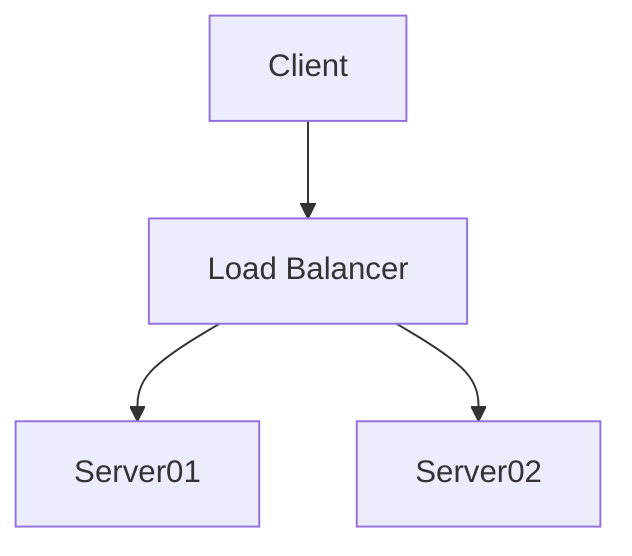

### Grundlagen von Markdown
#### Why?
Markdown wurde für genau einen Zweck entwickelt, nämlich Texte für das Web zu schreiben. Markdown hat nur wenige Basisformatierungen, die über einfache Auszeichnungen erfolgen, so dass kein ständiger Wechsel zwischen Menüleiste und Text schreiben erfolgt. Die Basisformatierungen sind deutlich einfacher gehalten als beispielsweise in HTML, so dass man mit geringem Lernaufwand produktiv werden kann. Die starke Verbreitung in unterschiedlichen Kollaborationsplattformen zeigt, dass es sich hier nicht um eine Randerscheinung handelt.

#### Zutaten
1. Ein Markdown-Editor 
Typora, Joplin, Texteditoren und Codeeditoren wie z.B. Visual Studio Code sowie Online-Editoren wie StackEdit und Dillinger
2. Geteilter Speicher oder gemeinsame Nutzung z.B. eines Moodle-Kurses
3. Evtl. Git zur Versionskontrolle (Für größere kollaborative Textproduktionen auf jeden Fall zu empfehlen)
4. evtl. Bereitstellungstools für verschiedene Veröffentlichungsformate (epub, pdf)
#### Text auszeichnen
Markdown kenn nur wenige Möglichkeiten der Textauszeichnung, nämlich kursiv und Fettdruck.
```markdown
*dieser Text erscheint kursiv*
**dieser in Fettdruck**
***und dieser sowohl als auch***
```
*dieser Text erscheint kursiv*
**dieser in Fettdruck**
***und dieser sowohl als auch***
Statt der Sternchen kann man auch Unterstriche verwenden. 

Weitere lassen sich mit Markdown nicht realisieren, es ist jedoch möglich HTML-Tags zu verwenden, z. B. `<s>durchgestrichen</s> `für <s>durchgestrichen.</s> oder `<p style="color:#FF0000";>Diesen Text bitte in rot!</p>` für <span style="color:red";> Diesen Text bitte in rot!</span>

Ein wichtiger Tipp 💡 noch: Weiterschreiben   
in einer neuen Zeile   
gelingt durch das Einfügen von mindestens zwei Leerzeichen am Ende einer Zeile.

#### Überschriften
Für Überschriften nutzt man den Hashtag, die Anzahl der Hashtags bestimmt die Größe der Überschrift, 1 Hashtag: größte Überschrift, 6 Hashtags: kleinste Überschrift.

Die Überschrift hier wurde erzeugt durch `#### Überschriften`.

#### Trennlinien
Mit dem Befehl `* * *` oder `---` kann man eine Trennlinie zwischen Abschnitten erzeugen.
* * *

#### Icons nutzen
`:bulb:` Diese Schreibweise kann in vielen Markdown-Varianten (wie in coggle.it oder typora) verwendet werden. In Joplin oder Moodle funktionieren sie nicht. Sie können aber Icons über die Tastatur nutzen. Mit Windows-Taste + Punkt wird ein Icon-Fenster mit mehreren Kategorien geöffnet. 😉     
Hier eine kleine Auswahl: 💙🕗🗨🔶.   
* * *
Tipp 💡: Dies können Sie auch z.B. in Chatfenstern anderer Programme nutzen.         
---
### Listen
#### ungeordnete Listen
Mit einem Sternchen plus Leerzeichen, wird ein Item als Aufzählung aufgefasst.
```markdown
* Lernvoraussetzungen
* Lernhandlungen
* Lernumgebung
```
* Lernvoraussetzungen
* Lernhandlungen
* Lernumgebung

#### Geordnete Listen
Hier geht man vergleichbar vor, nur stellt man immer eine Nummer mit einem Punkt voran:
1. Beobachtungen
2. Erklärungen
3. Alternativen
4. Zielerreichung

Um eine zweite Ebene zu erstellen, geben Sie zwei Leerzeichen vor dem Stern bzw. der Zahl ein.

#### ToDo-Listen
Eine Sonderform von Listen sind noch die sehr praktischen Todo-Listen:
Die Checkbocen werden durch ein Minuszeichen gefolgt von einem Leerzeichen und einem eckigen Klammerpaar mit einem inneren Leerzeichen erzeugt. Wird das Leerzeichen im Klammerpaar durch ein x ersetzt, erscheint die Checkbox mit einem Erledigt-Häkchen.
In Moodle werden diese aber unformatiert angezeigt.

- [x] Lesen
- [ ] Zusammenfassen
- [ ] Visualisieren


### Links und Bilder
Gerade im Web (und beim Schreiben dieses Portfolios) geht es darum auf Links setzen zu können sowohl intern im Dokument als auch intern. Weiter ist das Einbinden von Bildern sehr wichtig.

#### Bilder einfügen
Um Bilder nutzen zu können, kann man relative Pfade im Projektordner nutzen oder einen Link zu einer online-liegenden Quelle nutzen.

```markdown

```
Dem Ausrufezeichen folgt der Alternativtext in eckigen Klammern (für z.B. Screenreader) , in runden Klammern folgt der Link zum Bild und hinter dem Link kann optional noch ein Bildtitel in Anführungszeichen angegeben werden. 
Der Titel wird sichtbar, wenn man mit der Maus über das Bild geht.


#### Links
Diese funktionieren recht ähnlich zum Bild einfügen, nur das Ausrufezeichen fällt weg. 
Soll das Kapitel Meta-Professionswissen verlinkt werden, funktioniert:
`[Cheatsheet zu Markdown](https://opensource.com/sites/default/files/gated-content/markdown_cheat_sheet_opensource.com_.pdf)`
[Cheatsheet zu Markdown](https://opensource.com/sites/default/files/gated-content/markdown_cheat_sheet_opensource.com_.pdf).

* * *

### Spezielle Ergänzungen mit deutlich mehr Aufwand (eher sparsam nutzen!)
#### Tabellen
Tipp 💡: Mit dem Doppelpunkt können Sie angeben, ob die Spalten rechtsbündig oder linksbündig sein sollen.
Mit beispielsweise der Eingabe:
```markdown
| Artikel       | Kategorie     | Cool  |
| ------------- |:-------------:| -----:|
| Milch         | Lebensmittel  | 1,19 € |
| Butter        | Lebensmittel  | 2,29 € |
| Käse          | Lebensmittel  | 3,45 €|
```
erhält man:

| Artikel       | Kategorie     |   Preis|
| ------------- |:-------------:| -------:|
| Milch         | Lebensmittel  |   1,19 € |
| Butter        | Lebensmittel  |   2,29 € |
| Käse          | Lebensmittel  |   3,45 €|
  
#### Graphen mit Mermaid  
Viele Markdown-Versionen ermöglichen mittlerweile auch kleinere Diagramme, die mit Mermaid erzeugt werden, zu integrieren. Hierzu muss die Anweisung in einen Codeblock (begonnen und beendet mit drei Backticks) eingebettet werden und der Codeblock bekommt im Kopf die Kennzeichnung **mermaid**.
Dies funktioniert z. B. auch in Joplin oder Typora.



#### Sonderzeichen darstellen
```md
_dateiname_
\_dateiname_hello_
_italize Text_ 
```

_dateiname_
\_dateiname_hello_
_italize Text_ 

Es lässt sich das Escapezeichen nutzen, wenn man doch Sterne anzeigen möchte. Z. B. das Binnensternchen für das Geschlacht divers. Wobei heute viele dazu übergehen den Doppelpunkt hierfür zu verwenden.

_Coach\*in_
*Coach\*in*

```md
_Coach\*in_
*Coach\*in*
```
Fettdruck (bold) funktioniert mit Doppel-Stern oder Doppel-Unterstrich. Mir vereinfacht es den Unterstrich für italic-style und Doppelstern für Fettdruck zu wählen.

 #### Referenzstil für externe Links
 Ich kann einen Link auch nur an einer Stelle definieren, wenn ich ihn öfter verwenden möchte (Referenzstil)
[Spickzettel]

[Spickzettel]:(https://support.squarespace.com/hc/de/articles/206543587-Markdown-Spickzettel)


```md
Es gibt viele wertvolle Tipps für Markdown auf dem [Spickzettel].

Ich kann den Link aber auch nur an einer Stelle definieren, wenn ich ihn öfter Verwenden möchte (Referenzstil)
[Spickzettel]

[Spickzettel]:(https://support.squarespace.com/hc/de/articles/206543587-Markdown-Spickzettel)
```

