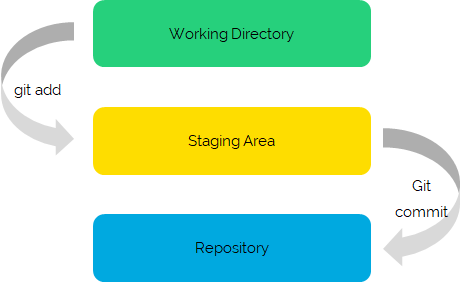

## Was ist Git
Git ist ein open Source Tool, dass Dir und Deinem Team helfen kann Euer Projekt gut zu koordiniern. Git versioniert nämlich alle im Git Repoitorie gespeicherten Dateien. Dabei werden die Dateien in der Cloud gespeichert und können von dort aus auf lokalen Rechnern geklont (d.h. kopiert) werden.

## Was möchten wir mit Git machen
Wir möchten, dass Du Git nutzt, um die Texte die Du schreibst zu archivieren und gleichzeitig die Texte der anderen an einem zentralen Ort wiederfindest. Durch Git könnt Ihr dann auch zusammen an den selben Texten schreiben.

Für den Anfang empfehlen wir aber erstmal direkt im Git Tool GitHub ein Repositorie anzulegen und zur Verwaltung Deiner Dokumente die GitHub GUI zu verwenden. Dies ermöglicht einen Schnellen Einstieg in Git. Im Woche ... gehen wir darauf ein, wie Du Git auf deinem lokalen Rechner verwenden kannst.

## GitHub

GitHub ist ein Versionsverwaltungssystem das auf Git aufbaut. Es unterstützt Projektmitglieder gleichzeitig an den selben Dokumenten zu arbeiten. 

Auf der [Seite von GitHub](https://docs.github.com/en/free-pro-team@latest/github/getting-started-with-github/signing-up-for-a-new-github-account) sind alle Schritte beschrieben, wie Du einen Git Hub Account angelegen kannst.

Nach dem Anlegen eines Nutzerkontos kannst Du direkt im [Grafical User Interface](https://github.com) (GUI) von GitHub arbeiten. Hier kannst Du im ersten Schritt ein Repository anlegen, wie das geht kannst Du in den [GitHub Docs](https://docs.github.com/en/free-pro-team@latest/github/getting-started-with-github/create-a-repo) nachlesen. Zu Deinem Repository kannst Du andere Personen einladen, die dann gemeinsam mit Dir alle Dokumente die in dem Repository abgelegt werden bearbeiten können.

Möchtest Du die Dokumente lieber auf Deinem Rechner bearbeiten kann Du ein Comand Line Tool das Git unterstütst instalieren. Wir empfehlen Windows Nutzern GitBash zu installieren, wie das geht ist [auf der Seite von Git for Windows](https://gitforwindows.org/) beschrieben. Mac Nutzer können die bereits vorhandene Terminal App nutzen und hier falls nicht bereits voehanden git installieren, wie dies geht ist [auf dieser git Seite](https://git-scm.com/download/mac) beschriben.

## Was sind Branches
Branches dienen dazu ...

